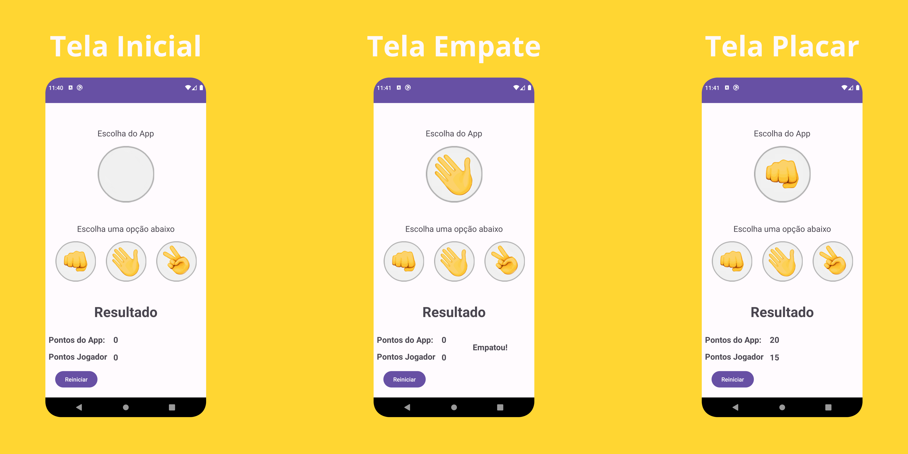

# Aplicativo do jogo Jokenpo (Pedra, Papel, Tesoura)

Aplicativo desenvolvido no Android Studio utilizando a linguagem Java, nesta branch de Improvements adicionei um sistema de placar com um botão de reinicio, para reiniciar a contagem de pontos.

Feito durante o curso de [Desenvolvimento Android Completo 2023 - Kotlin & Java](https://www.udemy.com/course/desenvolvimento-android-completo/).

## Screenshot

## License

Para acessar o arquivo de licença [clique aqui](./license).
